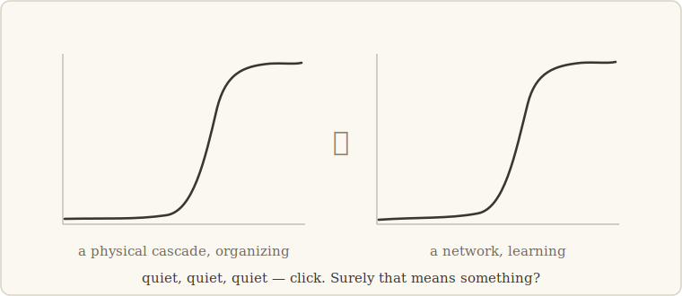

# 1 · The graveyard of resemblances

> *Ask not what a thing looks like. Ask what survives when you change everything about
> it.* — the lesson we walk with (our words, her stance)

## Two curves

Here are two curves.

The first comes from a physical system — a little cascade of instabilities, the kind
physicists build to study how order appears. For a long time nothing happens. Then,
rather suddenly, the system organizes: a new level of structure exists that wasn't there
before.

The second comes from a neural network learning to predict text. For a long time it
makes clumsy, local guesses. Then, rather suddenly, it *gets* something — it starts
using what appeared earlier in its input to shape what it says next. A new skill exists
that wasn't there before.

Put them side by side and something in you leans forward. *It's the same shape.* Two
systems with nothing in common — no shared parts, no shared scale, no shared equations —
and yet the same story: quiet, quiet, quiet, *click*. Surely that means something. Surely
there is one deep law underneath both.

This feeling is one of the great engines of science. It is also one of its great traps.

## Why resemblance is cheap

The trouble is that curves are easy. Take any two complicated systems, measure enough
things about each, and some pair of plots will look alike — smooth here, steep there, a
plateau, a knee. Resemblance costs nothing, which is exactly why it proves nothing.

There is a whole graveyard of grand unified theories built on this feeling — theories of
complexity, of self-organization, of emergence — each announcing that because ant
colonies, brains, markets, and sand piles produce similar-looking plots, one master
principle must govern them all. Some of these ideas were beautiful. Most of them died the
same death: when you asked *"what exactly does this predict, and what result would prove
it wrong?"*, the answer was another resemblance.

We wanted to take a walk through that same landscape — systems where new capabilities
appear — without ending up in that graveyard. So we adopted one rule before taking a
single step.

## The rule of the walk

**We never compare appearances. We only compare experiments.**

An experiment, for this walk, is three things written down together:

1. **A gesture.** Something you *do* to the system — the same physical move, performable
   identically in a toy model and in a real neural network.
2. **A signature.** The effect you predict the gesture will have, stated before you act.
3. **A kill criterion.** The outcome that would prove you wrong — also written down
   before you act, so you can't quietly move the goalposts after.

If the same gesture produces the same signature in systems that share nothing, you have
found something better than a resemblance. You have found an **invariant**: a statement
that stays true while everything around it — substrate, scale, architecture — changes.
And because the kill criterion travels with it, an invariant is always one experiment
away from dying. That is not a weakness. That is the whole point. A claim that can die,
and keeps not dying, is worth more than a thousand claims that merely fit.

## The woman whose lesson we borrowed

Emmy Noether was a mathematician working in Germany in the early twentieth century,
routinely described by the people best placed to judge — Einstein among them — as the
most important mathematician her field had produced. She left science two enormous
legacies, and our walk borrows from both. The first is a way of *defining things*: in
her algebra, an object is understood not by how it looks but by what remains unchanged
when you transform it — its invariants. The second is her celebrated 1918 theorem: every
continuous symmetry of a physical system hides a conserved quantity, something the
dynamics cannot destroy.

We are not physicists cosplaying, and this walk will not pretend that neural networks
are pendulums. What we took from Noether is smaller and sturdier: a *stance*. When faced
with systems that look bewilderingly different, don't collect resemblances — hunt for
the thing that stays the same under change, and let everything else follow from it.

## The contract with you, the reader

Since the rule of the walk is "written down before, checkable after," you should hold
this story to the same standard. So here is the contract:

- Every claim in these chapters was tested with a gesture, a predicted signature, and a
  pre-registered kill criterion. The chapters where *we* were the thing that got
  falsified are included — one of them (chapter 4) is the reason you can trust the rest.
- Nothing here rests on our word. Each figure links to a command in this repository that
  regenerates it — environment pinned, seeds recorded, expected numbers stated. The
  smallest experiments run on a laptop in minutes.
- We will always tell you what a result does *not* show. Where the trail goes cold, the
  map says so.

## Where we're going

The next chapter introduces the main character of this walk. It is not a network, and it
is not an equation. It is a **notebook** — the slow, quiet thing a fast system writes
and rereads to steer itself. Our single gesture, the one we will carry across every
substrate in this story, is disarmingly simple:

*Freeze the notebook, and see what dies.*

---

**What would have killed this chapter's idea — and didn't:** if no gesture could be
defined that transfers identically across substrates, the rule of the walk would be
empty piety. Chapter 3 shows the same freeze performed, unchanged, on a toy physical
cascade, a hand-built mini-network, and real language models trained by other people.
