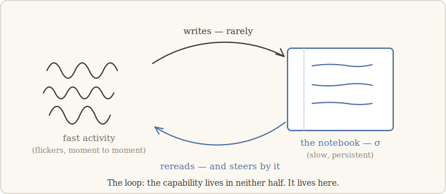
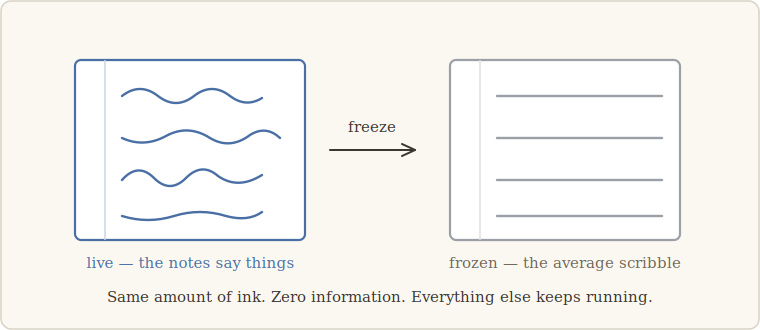

# 2 · The notebook

> *A thing that changes slowly is not asleep. It may be steering.* — the lesson we walk
> with (our words)

## Multiply two large numbers

Take 7,438 × 526. Try it entirely in your head, and unless you are one of a few unusual
people, somewhere around the third partial product the whole thing dissolves. Now take a
scrap of paper and do it again. Easy.

Notice what the paper is doing — and what it isn't. The paper performs no arithmetic.
Every operation happens in your head, fast, one flicker at a time. But between flickers,
your hand *writes* an intermediate result, and a moment later your eyes *reread* it. The
paper holds still while your thoughts churn; it changes only occasionally, only
deliberately, and everything downstream steers by it.

That loop — **fast activity writes a slow trace, then rereads it to steer** — is the
main character of this entire walk. We call the slow trace the **notebook**, and when we
need a symbol for it, we write σ. The pattern is everywhere once you see it: the
navigator's plot on a chart, steering hours of small rudder decisions; the sourdough
starter, a slow living memory that governs each fast bake; the scrap of paper under your
hand right now.

And here is the point of the multiplication story. If someone snatches the paper away
mid-calculation, your *capability* collapses — not because your neurons got worse, but
because the capability never lived in the fast part alone. It lived in the loop.

## Slow variables

"Slow" is relative, not absolute. A notebook isn't slow the way a rock is slow; it is
slow *compared to the activity it governs*, the way your written partial products are
slow compared to the flickers of mental arithmetic. It accumulates. It persists. It is
written rarely and read often.

Systems that learn turn out to be full of candidate notebooks:

- In a **transformer** answering from examples in its prompt, there is a stream of
  internal activity flowing position by position — and *written into it*, notes that
  later components reread to decide what comes next.
- In a **world model** — a network built to track a hidden, changing situation — there
  is a designated latent state, a notebook by explicit design.
- In the **toy physical cascade** we will meet next chapter, there is a slow memory
  that must charge up before a second level of structure can organize.

Three systems with no shared parts. In each, something slow, written, and reread.

## How *not* to recognize a notebook

Here is the mistake we most wanted to avoid, and it is seductive: *find the part that
looks structured and call it the notebook.*

It fails in both directions. Plenty of regions in a big system carry visible structure
and govern nothing — patterns that are exhaust, not steering. And a true notebook can
look like static to an observer who doesn't know the code. Appearance tells you almost
nothing, which after chapter 1 should sound familiar: recognizing notebooks by their
looks is the resemblance trap wearing a lab coat.

So we impose the same rule as everywhere on this walk. A notebook is not something a
system *has*. It is something an *intervention reveals*. You don't find it by staring;
you find it by acting — and, crucially, you must name your candidate **before** you act,
by a published criterion, not by poking around until something breaks and calling the
wreckage σ. (That temptation has a name later in this story; the discipline against it
was set before the first experiment.)

## The gesture: freeze

So we need a gesture. Here is ours, and it is the only one we will ever need.

**Freeze the notebook**: replace its content, everywhere it varies, by its own average —
the "average scribble." Same amount of ink. Same magnitude, same energy, same footprint.
Zero information. Everything else in the system keeps running exactly as before.

Why this gesture and not something cruder?

- **Why not tear the page out?** Because absence is loud. Remove a component entirely
  and the downstream machinery reacts to the *hole* — the budget changed, signals
  vanished, everything reroutes. You'd learn that the system notices vandalism, which is
  not news. The freeze keeps the budget intact and destroys only the *information*. If
  the capability dies, it died of ignorance, not of injury.
- **Why not inject noise?** Because a frozen page is the *opposite* of a noisy one — it
  is perfectly constant, the calmest object in the whole system. If freezing kills the
  capability, you cannot blame the disturbance; there is none. Something quieter
  happened: the loop went silent.

## The candidate invariant

Now we can say precisely what this walk went looking for:

> **If a capability lives in the notebook, freezing the notebook collapses it — in any
> substrate.**

And the claim comes in two arcs, because there are two moments to act:

- **The installed arc.** The system already has the capability. Freeze σ while it works:
  the capability it *carries* should collapse, there and then.
- **The formation arc.** The system is still learning. Freeze σ throughout training:
  the capability should never come to exist at all — not delayed, not degraded;
  *absent*. As if a student attended every lecture but was never allowed to take a
  single note.

The formation arc is the audacious half. It claims the notebook isn't merely used by the
capability — it is part of how the capability gets *built*.

## The objection you should be raising

If you have been reading critically, you have an objection ready, and it is a good one:
*"Of course breaking an important part breaks the system. You've discovered that engines
stop when you pour sugar in the tank. Where is the news?"*

That objection deserves a better answer than reassurance — it deserves *witnesses*:
control experiments, designed in advance, that would expose the freeze as mere vandalism
if vandalism is all it is. The next chapter brings three of them, and then takes the
gesture, witnesses and all, up a ladder of three worlds that share nothing.

---

**What would have killed this chapter's idea — and didn't:** if the freeze were just
damage in disguise, it would break every capable system it touched. Chapter 3 introduces
a twin that solves the same task *without* a notebook — from memory, in its weights. The
same freeze, applied to the twin, does nothing at all. Ignorance only kills those who
depended on the page.
