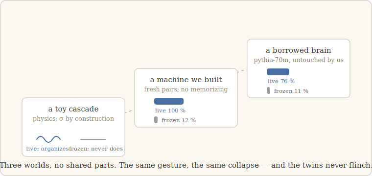

# 3 · A ladder of worlds

> *One system might flatter you. Three, chosen to disagree with each other, cannot.* —
> the lesson we walk with (our words)

## The plan

If the freeze only worked in one system, it would be a fact about that system. The claim
we are testing is bigger and more dangerous: *same gesture, same collapse, in any
substrate where a capability lives in a notebook.* So the plan was a ladder — a sequence
of worlds picked to have nothing in common, climbed one rung at a time, with the full
experiment (gesture, predicted signature, kill criterion) frozen in writing before each
climb.

## Rung 1: a piece of toy physics

The first world isn't a neural network at all. It is a small physical cascade — a system
of instabilities where order appears in stages, built precisely to study that. Inside it
there is a slow memory that must charge up before the second stage of organization can
happen: a notebook by construction, written by the fast dynamics, feeding back into
them.

Freeze it — replace the slow memory by its average, everywhere it varies — and the
second stage never organizes. The fast dynamics keep running; the ladder to the next
level of structure is simply gone.

One rung is nothing, of course. Cascades are the home turf of "order appears in stages."
The point of rung 1 is only that the gesture is *performable* here, and does what it
should. The test is whether the same gesture survives leaving home.

## Rung 2: a machine we built to leave no exits

The second world is a mini neural network we constructed ourselves, and the construction
has one job: **make memorization impossible.** The network sees a handful of pairs —
A→B, C→D, … — then gets asked "A?" and must answer "B". The trick: the pairs are *fresh
every single time*. There is no fixed fact to store in its weights; the only way to
succeed is to read the examples in front of it, note the pairings somewhere, and reread
that note when asked. A notebook isn't optional in this world. It's the only route.

We know where the notebook is, by construction: what the first layer writes when it
reads the pairs, reread by the second layer to answer. Freeze it: success collapses from
**100 % to about 12 %** — and we can tell you exactly why it isn't 0 %: with eight
possible answers, the task's shape hands you one-in-eight for free. The collapse is to
the floor, and we know the floor's name.

Now the witness this rung was built for. Take a *twin* network, same task — except the
pairs are **fixed forever**. This twin can, and does, learn the answers by heart; they
live in its weights, not in any note taken along the way. Same gesture, same freeze,
same everywhere: **the twin doesn't flinch.** So the freeze is not generic damage — it
is selective ignorance. It kills exactly those who depended on the page.

## Rung 3: a borrowed brain

The third world is the one that keeps us honest: **a real language model, pythia-70m,
trained by other people, never modified by us.** No construction tricks, no privileged
access to where anything lives. If the invariant is real, we must be able to *designate*
the candidate notebook in advance — by a published criterion, before any intervention —
and then act.

The capability: induction, the model's knack for using earlier context ("…if you saw
`A B` before, after `A` expect `B`…"). The criterion, fixed beforehand, selects the
model's induction heads — and, run blind, it recovers the very heads independently
documented for this model. The candidate notebook: the notes those heads reread.

Freeze it: **76 % → 11 %.**

## The witness that surprised us

At this rung, one of our planned controls betrayed us — in the most instructive way
possible. To show the collapse wasn't about *disturbance*, we had planned a shuffle:
scramble the notebook's entries and watch the capability die from scrambled information.

It didn't die. The shuffle did nothing.

Under the rule of the walk, that outcome had a name, and the name wasn't "adjust the
test until it works." The run was declared **non-conclusive against its own
pre-registered criterion**, and we went looking for what we had misunderstood. Here it
is: our shuffle had moved each note *whole* — label together with content — like
shuffling the cards of a phone directory. And a directory still works shuffled: whoever
looks things up doesn't care about the order of the cards. Our "scramble" was a
disguised *symmetry* — a transformation the reading mechanism is blind to.

So the real structure carrying the capability is neither the notes' values nor their
order. It is the **pairing between what the reader looks up and what it reads back**.
Re-pose the experiment properly and everything clicks into place:

- **Break the pairing** (shuffle labels and contents *independently*): capability dies —
  **5 %**, as dead as the freeze.
- **Preserve the pairing** (shuffle whole cards): capability survives — **73 %**, barely
  below the living 76 %.

And the failed control was promoted into a permanent member of the contract: every
experiment since carries a **symmetry control** — a transformation that must *not*
collapse the capability. It is the witness that proves the collapse is specific, not
"any perturbation kills." Our instrument grew teeth by failing.

## The scoreboard

One gesture, four verdicts per world, every threshold set before the run:

| | must **collapse** | must **collapse** | must **survive** | must **survive** |
|---|---|---|---|---|
| world | freeze | pairing broken | pairing preserved | twin without notebook |
| toy cascade | ✓ (2nd level never organizes) | ✓ | — | — |
| built machine | ✓ 100 % → 12 % | ✓ | — | ✓ untouched |
| pythia-70m | ✓ 76 % → 11 % | ✓ → 5 % | ✓ 73 % | — |

Three worlds without a shared part. The same gesture. The same signature — and the
controls, which had every opportunity to expose the freeze as vandalism, declined to.

The ladder didn't stop here: the same verdict later held on a second model family (a
collapse from 98.9 % to 0.1 %), on model families designed years apart, and on
capability types we hadn't met yet. Those climbs belong to later chapters — because
before any of that, we have to tell you about the day the ladder nearly collapsed under
*us*.

---

**What would have killed this chapter's claim — and didn't:** the twin flinching under
the freeze (it sat at its full score, untouched); or the pairing-preserving shuffle
collapsing the capability (73 %, next to the living 76 %). Either outcome was a
pre-registered death. Both witnesses testified for the defense.

**What *did* fail:** our first shuffle — and the walk kept the failure. It is the reason
the contract has a symmetry control at all.

*Notes for the curious.* Induction heads — the reading mechanism of rung 3 — were
mapped by Olsson et al. (2022); our blind selector recovers exactly the heads they
documented, which is what lets us designate the notebook *before* touching it. Rung 3
exists at all because the Pythia models were released fully open, training checkpoints
included (Biderman et al., 2023). And our freeze has a respectable cousin in the
interpretability toolbox — mean ablation (Wang et al., 2023; Zhang & Nanda, 2024);
what the walk adds is the pre-registration and the witnesses. Full references:
[`paper/references.md`](../paper/references.md).
