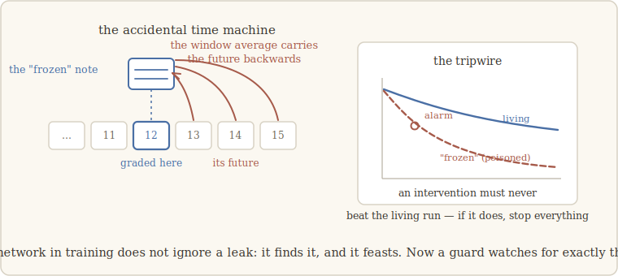

# 4 · The day we fooled ourselves

> *The most dangerous result is not the one that disappoints you. It is the one that
> flatters you.* — the lesson we walk with (our words)

## The big one

By this point in the walk, the installed arc was solid: freeze a notebook a system
already *uses*, and the capability it carries dies — three worlds, four witnesses. But
chapter 2 made a second, bolder claim, and it was still untested on anything real: the
**formation arc**. Freeze the notebook while the system *learns*, and the capability
should never come to exist at all.

Testing that on a real network is expensive. You cannot borrow a pretrained brain — the
capability already exists in it. You must train networks *from scratch*, on real data,
several times over: living runs, frozen runs, shadow runs. We built the setup, trained
on real code, watched the living runs develop their induction ability right on schedule
— and launched the frozen battery.

The early numbers came back astonishing.

## Too good — on the wrong side

One frozen run was learning with an early loss of **2.59** where its living twin sat at
**10.6**. A shadow run finished at a loss almost indistinguishable from zero — a figure
that a network this small has no honest way of reaching on real code.

Read that again, because it is the exact opposite of what our own hypothesis predicted.
The interventions weren't failing to form. They were **beating the living runs**. If
you believe numbers when they agree with you, you should believe them when they don't:
either the formation arc was dead wrong — or something was very sick in the instrument.

It took a day to find it, and the battery was stopped the same day.

## The leak

Here is what we had done. In the toy of the earlier chapters, our freeze replaced the
notebook with its average *over the whole window* — and there, that is innocent,
because the toy is only ever graded at the final position: everything in its window is
already the past.

A real language model is graded differently: it predicts **at every position**. Take
the average over the whole window and hand it to position 12, and you have just
delivered to position 12 a digest of positions 13, 14, 15… — *the future*. Including
information about the very tokens it is being asked to predict.

At inference, such a slip merely flatters a score. But we were *training* under the
intervention — and *a network in training does not politely ignore a leak: it finds it,
and it feasts.* Gradient descent discovered the time machine we had accidentally built
into the freeze, and learned to read tomorrow's answers through it. Our "frozen"
networks weren't learning the language better than the living ones. They were cheating
on an exam we didn't know we had set.

## What do you do with a poisoned battery?

Everything from that battery was suspect. We did four things, in this order, and the
order is the lesson.

**First, stop.** Five intervention runs — weeks of compute — were declared invalid and
set aside. Not reinterpreted. Not salvaged. (The three living runs, which trained under
no intervention, remained valid.)

**Second, ask the ugly question in full.** *Does the same defect contaminate everything
before?* We wrote down the criterion an experiment must meet to be at risk — it must
move future information across the grading point, AND give the system a chance to
*learn* to exploit it — and audited every prior step against it. The earlier worlds
passed: the toy is graded only at the end (no future to leak); the borrowed brains were
never *trained* under the intervention (a model can only learn to exploit a leak if it
trains on it) — and where any doubt remained, we re-ran the freeze in its clean causal
form and got the same collapses to the third decimal. The ladder stood. Only the new
battery was poisoned.

**Third, rebuild the gesture so the mistake is impossible.** The freeze became: replace
the note at position *j* by the average of *other, independent sequences* at position
*j* — same silencing of the notebook, and nothing from this sequence's future can reach
its past, by construction.

**Fourth — and this is the part we are proudest of — give the lesson teeth.** A rule
this important must not depend on us remembering it. So it became machinery: every
training-time intervention is now checked for causality before the run starts, and a
tripwire watches every experiment for the exact symptom that betrayed the leak — **an
intervention must never beat the living run.** Replayed on the archived poisoned logs,
the tripwire fires within the first few million tokens. The instrument now catches, in
minutes, what had cost us weeks.

## And then, the real answer

The battery was relaunched, clean, with the same pre-registered criteria as before.
This time the frozen runs behaved neither better nor mysteriously — they behaved like
the formation arc predicted. Trained out to **sixteen times** the point where every
living run forms its induction ability, the frozen networks formed it **zero times out
of three** — flat at the floor, while all six living runs climbed. And a calibrated
information audit confirmed they hadn't smuggled the capability in through some other
door.

Freezing the notebook during a real network's training doesn't delay the capability. It
prevents it from ever existing.

## Why this chapter exists

We could have omitted this episode. The final result is the same; the paper would look
cleaner. But you would then have to take the clean result on faith — and the walk's
contract says you never have to.

The strongest reason to believe our numbers is not that we are careful. It is that when
our instrument lied to us, *the lie was caught, named, dated, audited, and turned into
an automatic guard that has been biting ever since* — and the episode is in the record,
poisoned logs and all. An instrument that has publicly survived its own failure is worth
more than one that has never been seen to fail.

---

**What would have killed the formation arc — and didn't:** a single frozen run forming
its induction ability. Zero of three did, at 16× the living formation point, under
criteria frozen before the relaunch.

**What *did* fail:** us. The freeze leaked the future into training, the networks
learned to drink from it, and five runs went into the bin. The failure is chapter 4 of
this story — and the reason there is a tripwire in every experiment since.
