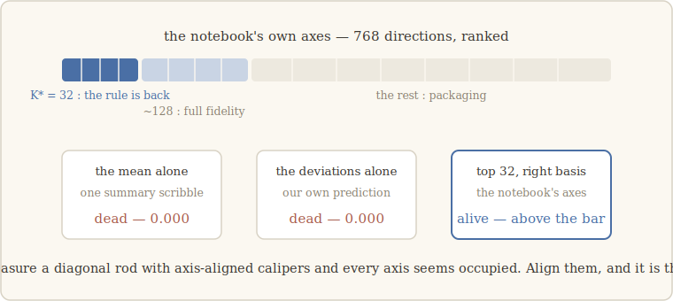

# 5 · How big is a notebook?

> *Before you trust a measurement, measure your ruler.* — the lesson we walk with
> (our words)

## The next question a walker asks

The freeze established that the notebook is *necessary*. But necessity tells you almost
nothing about the object itself. If Noether's first legacy is to understand things by
their invariants, then the natural next question about σ is the most concrete one
imaginable: **how many independent dials does it have?** Is a rule written across all
768 dimensions of the model's residual stream, or does it live somewhere smaller?

We asked this about the notebooks of *rules* — the in-context instructions of chapter
3's fourth world — because they collapse most cleanly (to 0.000 exactly, under the
freeze). And the question promptly made fools of us twice.

## Two beautiful wrong guesses

**Guess one: the notebook is its average.** A rule's demonstrations are interchangeable
— we verified that shuffling their order changes nothing (a symmetry control that
survives). So perhaps everything the reader needs is the *mean* of the notes: one
summary scribble. Test: keep only the mean, discard the rest. Result: **0.000** — as
dead as the full freeze. The average carries nothing.

**Guess two — ours, in writing: then it's in the deviations.** If not the mean, surely
the structure *around* the mean. Test: keep only the centered deviations, discard the
mean. Result: **0.000** again. Our own pre-registered prediction, dead on arrival.

Worse, the dose-response curve was brutal: the capability needs **at least three
quarters of the full σ** before it wakes up at all. Every reduction we tried died. The
notebook began to look *irreducible* — 768 dimensions, all of them somehow necessary.

## The resolution: we were holding the ruler diagonally

The escape came from a simple suspicion: maybe the object is small but **tilted**.
Measure a thin diagonal rod with axis-aligned calipers and every axis seems occupied;
align the calipers with the rod and it is thin after all. Mean-vs-deviations was an
axis-aligned question. So we let the notebook choose its own axes — the directions
along which σ actually *varies* — and asked the question again in that basis.

Answer: **32 dimensions out of 768.** Keep the top 32 directions and the rule comes
back above the pre-registered bar; keep ~128 and you have full fidelity; the remaining
~600 directions are packaging. The earlier failures were not evidence of
irreducibility — they were tests of *one* coordinate against an object that needs
thirty-two. That number, K\*, is the walk's first true **measurement** of the notebook.

## Is 32 real? Shake it and see

A number you've measured once is an anecdote. So we shook it:

- **A bigger sibling** (same family, residual stream widened 768 → 1024): K\* = **32**,
  exactly. The dimension belongs to the notebook, not to the container.
- **A different family** entirely: K\* = **16** — not identical, but the same *order*.
  (Hold that difference in mind; it becomes chapter 6.)
- **A stronger compressor.** PCA only knows straight lines — perhaps a *curved*
  compression does better? We trained a nonlinear autoencoder to try: it found
  **32** too, not one dimension fewer. The notebook is a flat sheet, not a curled one.
  (Honesty note: our first autoencoder failed its own sanity check and was amended, in
  writing, before we read any verdict from it.)

## Measuring the ruler itself

One worry remained, and it was the deepest: our basis ranks directions by how much σ
*varies* along them. What if variance is a bad judge — a few loud directions that the
task never reads, or a quiet direction the task depends on? Then K\* would be an
artifact of the ruler, not a size of the object.

So we built a second, independent ruler: rank the same directions not by variance but
by **attribution** — how much each direction actually matters to the task, content
times sensitivity. If the two rulers disagree, variance lies.

They agree. On three different model families, the dimension read off the
variance-ordered ruler and the attribution-ordered ruler is **identical** — and the
recovery curves match at every intermediate size. We also hunted two specific gauge
artifacts (a normalization-folding effect, and a rank-one variance spike) and cleared
both. The scale is straight. When chapter 6 compares K\* across architectures, the
differences will be properties of the *models* — not of our calipers.

## So — is 32 "the" size of a notebook?

For a while we believed something like that: every real model we measured gave ~O(20)
and it was tempting to whisper *universal constant*. The next chapter is about the
model that broke that whisper — and about what actually sets the size of a notebook,
which turned out to be more interesting than a constant.

---

**What would have killed this chapter — and didn't:** the two rulers disagreeing
(variance vs. attribution) would have voided K\* as a gauge artifact; they matched on
all three families. **What *did* fail:** both of our reductions — the mean *and* our
own written prediction that the rule lived in the deviations. The object survived our
guesses about it; that is what being measured, rather than imagined, looks like.

*Notes for the curious.* The discovery that in-context rules condense into compact
vectors is Hendel et al. (2023) and Todd et al. (2024) — K\* refines "compact" into a
number with a validated ruler. The finding that the notebook is a *linear* subspace
joins a broader current on linear structure in model representations (Park et al.,
2023). Full references: [`paper/references.md`](../paper/references.md).
