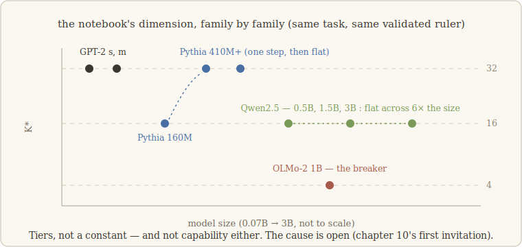

# 6 · Not all notebooks are alike

> *A constant is a hypothesis wearing a crown.* — the lesson we walk with (our words)

## The whisper

By the end of chapter 5 we had a validated ruler and three measurements: 32, 32, 16.
Same order of magnitude, across two model families and two sizes. If you have ever done
research you know the whisper that starts then: *maybe it's a constant.* Maybe every
notebook of this kind, in every transformer, measures a few dozen dimensions — a
universal number, like a fingerprint of in-context learning itself.

We wrote the whisper down (that's what you do with whispers, so they can be killed
properly) and designed the campaign that would test it: more families, more sizes,
newer architectures.

## Size first — and size loses

If K\* were driven by *scale*, bigger models should have bigger notebooks. They don't:

- One modern family, measured at **0.5B, 1.5B and 3B parameters** — a sixfold range:
  K\* = **16, 16, 16**. Flat.
- The Pythia family: 16 at its smallest, one step up to **32** by 410M parameters, then
  flat ever after — a finite-size effect that saturates, not a scaling law.

Whatever sets the size of a notebook, it is not the size of the model.

## The breaker

Then came OLMo — a fully open model, built by AllenAI with a different internal layout
than anything we had measured. Same task, same validated ruler:

**K\* = 4.**

Not 32, not 16. Four. Our first reaction was the correct one — suspect the instrument:
re-measured on fresh seeds (real, not evaluation noise); re-checked against the
attribution ruler from chapter 5 (the two rulers agree *on this very model*); hunted
two specific gauge artifacts and cleared both. K\* = 4 is a fact about the model, not
about our calipers.

So, two public retractions of our own readings:

- **"K\* is a universal constant"** — dead. The measurements arrange in **tiers**:
  ≈4 ≪ ≈16 < ≈32, and the tier is set by the **architecture**.
- The next tempting reading — **"smaller K\* = weaker model"** — also dead, and we held
  it for less than a day: the model with K\* = 16 *outperforms* the model with K\* = 4
  on standard benchmarks. The notebook's dimension does not measure capability.

## Hunting the cause — and losing, so far

What, in an architecture, compresses a notebook eightfold? The suspects had names: the
OLMo-style layout differs from the others most visibly in *where* it places its
normalization layers (after the blocks rather than before), and in what *kind* of
normalization it uses.

So we did what the walk always does: built matched toys — identical twins differing in
exactly one suspect at a time, trained through formation — and measured their notebooks.

- Norm **placement** (none / before / after): K\* = **32, 32, 32**. Falsified.
- Norm **type** (both placements × both types, five variants in all): **all 32**.
  Falsified.

Worse — instructively worse — the little toy pins at 32 *no matter what we do to it*:
it cannot even be pushed into the low tier. Which means the mechanism that produces
K\* = 4 lives in properties of full-scale architectures that our minimal toy doesn't
possess. The cause is **open**. We state that plainly, and chapter 10 will list it as
an invitation rather than bury it in a footnote.

## What survives the wreckage

It might sound like this chapter only destroyed things — a constant, two readings, two
causal hypotheses. But look at what is left standing, because it is sturdier than what
fell:

- **Low dimension itself is robust.** Every notebook we have ever measured is *tiny*
  compared to its container — 4 to 32 dimensions out of many hundreds — across every
  family, size, and architecture tested. That qualitative fact never wobbled.
- **The tiers are real, and the ruler is straight.** The differences are properties of
  the models — which turns K\* from a would-be constant into something more useful: a
  *probe*. Architectures leave a signature in how much room their notebooks take. Nobody
  yet knows why; whoever finds out will have learned something true about how
  transformers organize what they write.

A constant would have been prettier. A structured, unexplained pattern is better — a
constant ends conversations; a pattern starts them.

---

**What would have killed this chapter — and didn't:** the two rulers disagreeing on the
outlier (K\* = 4 as a gauge artifact); they agree, and fresh seeds confirm. **What
*did* fail:** our universal-constant reading, our capability reading, and both of our
causal hypotheses about the norm — all four retired in writing. The tiers survived
everything we threw at them; their cause has so far survived us.

*Notes for the curious.* The pre-norm / post-norm distinction that our matched toys
interrogate is analyzed in Xiong et al. (2020). The measurements in this chapter exist
because some organizations release genuinely open models — Pythia (Biderman et al.,
2023) and OLMo (OLMo Team, 2024) most of all; the modern flat-at-16 family is Qwen2.5
(Qwen Team, 2024). Full references: [`paper/references.md`](../paper/references.md).
