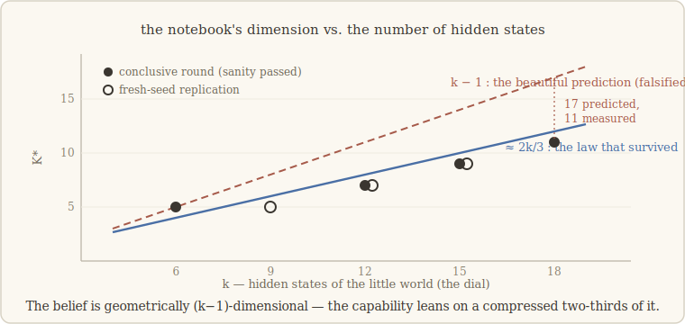

# 7 · A law at last — but not the one we wanted

> *The most dangerous moment in a measurement is when it starts agreeing with a
> beautiful theory.* — the lesson we walk with (our words)

## From tiers to a dial

Chapter 6 left K\* as a *categorical* fact: architectures sort into tiers, cause
unknown. A physicist would call that taxonomy, not law. A law needs a **dial** — a
quantity you control, with a theory that predicts K\* as a function of it, declared
before you measure.

Hidden-state tracking hands you exactly that dial. Build a little world with **k hidden
states** that drift according to fixed rules, and let the system see only ambiguous
clues about which state it's in. To predict what comes next, the system *must* carry a
running belief — "probably state 3, maybe state 5" — and update it clue by clue. That
belief is a notebook by necessity (fresh sequences make memorization impossible), and
the theory of belief geometry makes a crisp prediction: a belief over k states has
**k−1 degrees of freedom**. So the notebook's dimension should be:

> **K\*(k) = k − 1** — and k is a dial we can turn.

We wrote the number down before touching anything. Then the walk turned into a
four-round fight between a beautiful prediction and our own rules.

## Round one: the prediction fails on contact — and then winks at us

First measurement (k = 3, 5, 9), under the metric frozen in the plan: K\* came out
**flat** — no growth with k at all. Under its pre-registered criterion, round one
falsifies the law outright.

But looking at the *saturation* of the curves — where reconstruction stops improving —
there was a pattern, and it sat suggestively close to k−1. Here is where the walk's
discipline earns its keep: a pattern noticed *after* the fact is *not a result*. It
went into the record labeled **post-hoc motif, not claimed**, and a fresh round was
designed around a saturation metric declared *in advance*.

## Round two: the motif shines — and the test disqualifies itself

Fresh values of the dial (k = 4, 7, 10, 13), saturation metric pre-declared. The motif
appeared in full glory: strict monotonicity, values nearly on k−1. The beautiful
prediction, apparently vindicated.

Except. Every round carries its own sanity criterion — ours said the probe reading the
belief out of σ must reach R² ≥ 0.80, or *the test has no standing to speak*. It read
0.52–0.71. So the rule fired on ourselves: **formally non-conclusive**, claim nothing,
however lovely the curve. (The temptation, we can now admit, was considerable.)

## Round three: worse — but it tells us where the notebook lives

Diagnosis: maybe the toy was too shallow for the probe. So, a deeper toy. Result: the
probe got *worse* (R² 0.41–0.59) — and the failure had a mechanism in it. In a deep
model, the belief is built up **across layers**; what sits at layer 1 is only an early,
partial estimate that later layers recompute. Our σ was aimed at the wrong floor of the
building. **The notebook migrates with depth** — a finding that anyone pointing probes
at deep models needs, and which we got by failing twice.

## Round four: the test finally speaks — and kills the beautiful prediction

Aim σ at the **belief-complete layer** (where the running belief is fully assembled),
fresh dial values (k = 6, 12, 15, 18), retrain everything. Sanity: R² = **0.91–0.95**,
passed everywhere. For the first time in four rounds, the test had standing.

Verdict: there **is** a law — K\* climbs strictly with k (5, 7, 9, 11), near-linearly,
replicated on fresh seeds. And it is **not k−1**. The gap grows with k (at k = 18 the
prediction says 17; the measurement says 11). On that stretch of the dial, the fitted
slope read close to **2/3** — hold that number loosely; a signpost awaits below.

## What the broken prediction taught

Why so far below k−1, when the belief has k−1 degrees of freedom? Because — and the
probe itself proves this — the belief **is** geometrically (k−1)-dimensional: σ
contains it at R² ≥ 0.91. But its predictive weight is *front-loaded*: a compressed
core of directions does most of the forecasting work. K\* never measured geometry. It
measures the **predictively load-bearing** dimension — the part of the notebook the
future actually leans on — and that part is a fraction of the simplex.

So the walk got its first functional law by refusing the prettier ones — k−1 twice,
once when it winked post-hoc and once when it shone through a disqualified test; and
later, as the signpost below records, even our own first coefficient.
There is one loose thread, though. If the *geometry* is really all there, some
architecture ought to be able to keep it all… and there is a kind of machine whose
notebook is not discovered but **declared**. What happens to the law there is the next
chapter — and it is the sharpest result of the whole walk.

## 🪧 A signpost, hammered in after publication

*(July 2026 — the walk kept walking.)* **Ahh — no. Not two-thirds. One half.**

Round four carried a published reserve: *"the exact factor would need more k."* We
cashed it. Dial extended to k = 24, 30, 36, two seeds each, on top of the consolidated
points below. Over **eight values of k**, the law comes out **K\* = 0.44·k + 2
(R² = 0.984)** — and head-to-head, **k/2 fits six times better than 2k/3**; at the
three largest k the measurement is k/2 *exactly* (12.5, 15.5, 18). Our pretty fraction
was an artifact of fitting through the origin on a short dial, where the little +2
intercept masquerades as extra slope.

What survives — strengthened: the law exists, monotone, linear, better measured than
ever; and the compression is *deeper* than we first told you — one half, even further
below the geometric k−1. The chapter above is kept as it was lived; the number to carry
away is **k/2**. Proof table and the other post-publication verdicts:
[the epilogue](epilogue-postcards.md).

---

**What would have killed this chapter — and didn't:** a flat K\*(k) in round four (no
law at all — round one's first metric had already threatened exactly that). **What
*did* fail:** K\* = k−1, the prediction we *wanted* to be true — held at arm's length
through two rounds that flattered it, then falsified by the first test with standing to
speak. Replicated on fresh seeds. The law that survived is less beautiful and more
interesting.

*Notes for the curious.* The prediction we tested comes from belief-state geometry —
Shai et al. (2024) showed transformers *represent* the belief simplex in their residual
stream, a lineage that runs back to computational mechanics (Crutchfield & Young,
1989). Our result agrees with the geometry (the probe finds it) and adds the
interventional twist: what the capability *leans on* is a compressed fraction of it —
one half, once the dial was long enough to measure it honestly.
Full references: [`paper/references.md`](../paper/references.md).
