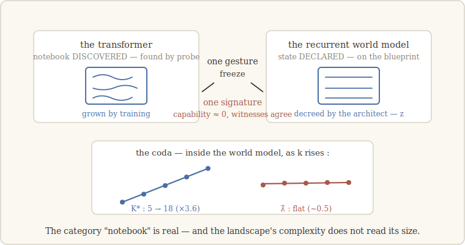

# 8 · The declared and the discovered

> *If a category is real, it should not care how its members were made.* — the lesson
> we walk with (our words)

## Two ways to have a notebook

Every notebook in this story so far had to be **found**. The transformer never told us
where it kept its running belief; we located it with probes, pre-registered the
address, and only then froze. Call these notebooks **discovered** — they exist because
training happened to build them, and finding them is detective work.

But there is a second kind of machine, built on the opposite philosophy. A **world
model** of the classic recurrent design (an RSSM) has its notebook *by construction*:
a designated latent state z, declared in the blueprint, through which everything must
pass. No detective work — the architect points at the notebook on the schematic.

Here is the sharpest question the walk knows how to ask. Chapter 1 promised invariance
under change of substrate. But "discovered in a transformer" versus "declared in a
recurrent world model" is not a change of substrate so much as a change of **ontology**
— an object training *happened* to make, versus an object a human *decreed*. If the
invariant respects that divide, "notebook" was two categories wearing one name. If it
crosses…

## The crossing

Same little world as chapter 7 — k hidden states, ambiguous clues, belief obligatory.
Train the recurrent world model; freeze its declared z; run the witnesses.

**Same gesture, same signature.** The capability collapses to ≈ 0 — the exact death we
know from the transformer's discovered notebook — with the shadow collapsing alike and
the controls surviving. Two architectures that share no mechanism, no training
objective, not even a *kind of existence* for σ: one death.

This is, quietly, the result the whole walk leans on. It says the notebook is not an
artifact of how we find notebooks. Discovered or declared, grown or decreed — if a
capability lives in a written-and-reread slow state, freezing that state kills it. The
category is real, and the invariant is its detector.

## The dimensional twist

Chapter 7 left a loose thread: the belief has k−1 geometric degrees of freedom, yet the
discovered notebook only *leans on* ≈ 2k/3 of them. So what does the **declared** state
keep? Measure K\* on z: **≈ k−1** — 6, 11, 16, 16 against a predicted 5, 11, 14, 17.
The declared state carries the whole simplex.

The contrast is beautiful once you see why. A *declared* state is a shop window: the
blueprint routes every downstream computation through z, so z must display everything —
the full geometry survives by decree. A *discovered* notebook is a pocket diary: shaped
by nothing but the training pressure, it keeps what the future actually pays for and
compresses the rest. **Same world, same belief — the ontology of the notebook decides
how much of the geometry it retains.** Both laws replicate across seeds, with declared
> discovered at every k.

## Coda — the pair that killed a bridge

One more thing this pair of machines did for us, and it happened in a single day.

Morning: a conjecture too tempting not to test. We had K\* (the notebook's dimension,
measured on activations) and λ̂ (a complexity of the loss landscape, measured on
weights — chapter 5's geometric anchor). On the transformer family, turning the dial k
made them rise **together** — correlation 0.86, our pre-registered prediction
supported. A bridge between object and dynamics! But the fine print, flagged in the
plan itself: λ̂ tracked k even better (0.95), and at one coincidence — two k values
sharing K\* = 5 — λ̂ nearly doubled anyway. Correlation via a shared cause is not
reading.

Evening: only one lever can settle it — something that moves K\* while k stays put. We
*had* that lever; it is this chapter. At fixed k, the declared state's K\* (≈ k−1) sits
far above the discovered one's (≈ 2k/3). If λ̂ reads K\*, it must follow. It did the
opposite (correlation of the differences: −0.97) — and inside the recurrent model
alone, K\* more than tripled while λ̂ sat flat. **λ̂ does not read the notebook.** It
belongs to the architecture's landscape; K\* belongs to the task; they had only been
walking in step because k dragged them both.

Built in the morning, bounded by evening — conjecture, support, reserve, falsification,
all under pre-registered criteria, in one day. We kept the episode in full because it
is the walk's machinery at its fastest: the same matched pair of machines that carried
our central result was reused, hours later, as the instrument that killed our newest
one. A good substrate pair is worth more than any single finding it produces.

---

**What would have killed the crossing — and didn't:** the declared state shrugging off
the freeze (the invariant would have been a fact about transformers, not about
notebooks). It died to ≈ 0, same signature. **What *did* fail:** our freshest
prediction — that the landscape's complexity reads the notebook's size — falsified by
this very pair within the day, and reported with the same font size as the successes.

*Notes for the curious.* The recurrent world model is the RSSM of Hafner et al. (2019),
the workhorse of model-based reinforcement learning — chosen precisely because its
latent state is declared. The belief geometry that the declared state retains in full
is the object of Shai et al. (2024). The landscape complexity λ̂ is the local learning
coefficient (Watanabe, 2009; Lau et al., 2024). Full references:
[`paper/references.md`](../paper/references.md).
