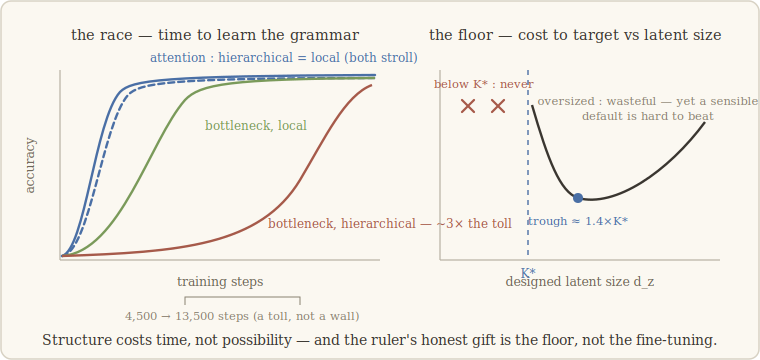

# 9 · What structure costs

> *Before declaring something hard, check who is being asked to do it.* — the lesson we
> walk with (our words)

## An old quarrel walks in

So far the walk has asked whether notebooks exist, what kills them, how big they are.
This chapter asks a different kind of question — one that linguistics has fought over
for seventy years: **does structure cost anything?**

The short version of the quarrel. Chomsky argued that human language is organized
**hierarchically** — sentences nest inside sentences, and rules track the *structure*,
not the surface order — and that languages violating this design should be effectively
unlearnable: "impossible languages." In the LLM era the argument sharpened: Chomsky and
colleagues asserted that language models learn impossible languages as readily as real
ones — and therefore tell us nothing about language. Kallini and colleagues then did
the obvious, overdue thing: they *tested* it, training GPT-2 on deliberately impossible
languages. Result: the models learn impossible languages **worse**. The assertion was
wrong on the facts.

Our question is one mechanistic level down: **when** should structure cost something,
and **who** pays? A walker with a freeze in one pocket and a dimension-ruler in the
other can ask that precisely.

## First try: the task was too easy to tell anyone apart

Build two matched grammars. In both, a verb must agree with a noun; the only difference
is *which* noun. The **hierarchical** grammar picks the structurally correct subject,
across nested clauses ("the key to the cabinets... *is*"); the **local** grammar picks
the nearest noun. First finding, for the invariant's ledger: the freeze kills syntactic
agreement like everything else — a seventh capability type, with the smallest notebook
yet (K\* ≈ 2, essentially one bit of agreement plus an address).

But on the *cost* question, our little attention toy shrugged: it learned both grammars
trivially, same speed, same everything. Not a verdict — a lesson about substrates:
for a distinction to show, the task must be hard enough for someone to pay.

## The race

So: a harder grammar (deeper nesting, distractor nouns in the way), and two racers of
honest strength.

- **The attention racer** strolls. Hierarchical, local — both reach perfect accuracy,
  fast, even for a deliberately weak model. No surcharge whatsoever. And mechanically
  it is obvious why: attention reaches *any* position at the same price. Non-local is
  not a concept attention pays for.
- **The recurrent racer** — a state-bottleneck machine, everything squeezed through a
  small latent — pays in full view. At matched configuration, the hierarchical grammar
  takes **~3× longer to learn** (13,500 steps against 4,500): tracking the true
  subject across the distractors must be *carried* through the bottleneck, step after
  step. And a crucial check: it is a **toll, not a wall** — run long enough and even a
  tiny state gets there. Structure costs *time*, not possibility.

## The twist that reframes the quarrel

One more racer settles what the cost is *made of*. We added an **unnatural** rule — a
counting-based agreement no human language uses. If the toll tracked "naturalness,"
counting should be slow too. It formed **as fast as the local rule**.

So the cost does not follow naturalness. It follows **non-locality** — the need to
maintain state across intervening material — and it is paid only by architectures that
bottleneck state. The Chomskyan "impossible ≈ possible" claim turns out to be
**architecture-relative**: true on attention (where structure is free), false on
recurrent machines (where it shows as learning speed) — and in *speed*, not
possibility, which is also the shape of Kallini's original findings.

And our own honest failure belongs in this ledger: we tried a scaled-down replication
of the Kallini setup, and our bijective "impossible" languages (shuffles, reversals)
were learned *better* than natural text — because attention undoes any deterministic
reordering for free, exactly as the race predicts. Genuinely hard impossibles need
counting and unbounded memory, at real scale; that substrate design is beyond our toys,
and we say so rather than stretch.

## What the ruler buys, while we're here

Structure's cost was about *learning*. The notebook's dimension also prices *design*.
On the world models of chapter 8, we asked: how small can the declared state z be? The
answer is the most practical sentence in this walk: **K\* predicts the floor.**
Latents sized below K\* never reach the target at any budget we tried; the
cost-to-target curve bottoms out near **1.4×K\***; and gross overprovisioning wastes a
factor we report honestly (3–8×, large only against a naive default). Measure the
notebook first, then size the container: the interventional number is an engineering
number.

---

**What would have killed this chapter — and didn't:** the toll being a wall (a
capacity claim would have been far stronger — and false; the long runs killed that
reading before we could be tempted by it). **What *did* fail:** our scaled-down
impossible-languages substrate — instructively, in the exact direction the mechanism
predicts.

*Notes for the curious.* The hierarchy claims are Chomsky (1957; 1965); the modern
"impossible languages" framing is Moro (2016); the assertion that LLMs learn impossible
languages as easily as possible ones is Chomsky, Roberts & Watumull (2023); the
experiment that tested and refuted it is Kallini et al. (2024) — our race explains
mechanistically when their effect should appear and when it must vanish. The poverty-
of-the-stimulus debate is deliberately untouched by everything here. Full references:
[`paper/references.md`](../paper/references.md).
