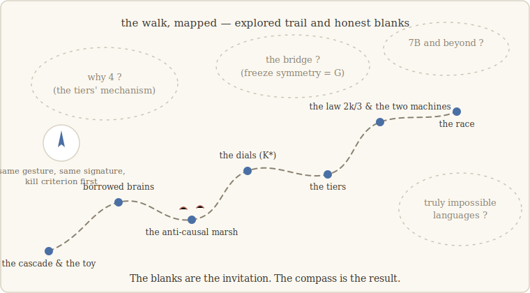

# 10 · Where the trail goes cold

> *A map is honest in exactly one way: by drawing its blank regions blank.* — the
> lesson we walk with (our words)

## The territory crossed

Nine chapters ago we set one rule — compare experiments, never appearances — and picked
one gesture. Here is the territory it crossed, said plainly.

**The invariant held everywhere it was put at risk.** Freeze the notebook and the
capability it carries dies; freeze it during learning and the capability never comes to
exist. A toy cascade, a machine built to forbid memorization, borrowed brains from four
model families, a network trained from scratch on real code, seven kinds of capability
— and one crossing of the deepest divide we could find, between notebooks that training
*grew* and states that architects *decreed*. Four witnesses at every step, thresholds
set before every run. It was one experiment away from dying, dozens of times. It
didn't.

**The object got measured.** Notebooks are tiny (4–32 dimensions in containers of
hundreds), linear, separably composable, irreducible to summaries — and their size is
set by architecture in tiers no one can yet explain, while on state-tracking tasks it
follows the first functional law of this program, K\* ≈ 2k/3: capability leans on a
compressed core of the geometry it carries.

**The dynamics got a shape.** Formation is gradual at the mechanism level — no critical
point, no peaked conserved current — but it leaves a structural imprint in the loss
landscape's singular geometry, it locks the notebook's dimension the moment the
capability forms, and two of its properties were *predicted* before being measured.

**And the walk kept its dead.** The anti-causal leak, the falsified k−1, two retracted
readings of K\*, the bridge built and bounded in a day, the failed impossible-languages
substrate. Every one is in the record at full font size, because they are why you can
trust the rest.

## The blank regions

What this walk does **not** claim is written in the paper's driest section (§8). What
it *invites* is better said here. Six blank regions, in rough order of how itchy they
are:

1. **Why four?** One architecture compresses its notebooks to K\* = 4 where others
   keep 16 or 32, and every cause we tested is falsified. Somewhere in a full-scale
   architecture there is a mechanism that squeezes what a model writes eightfold —
   whoever finds it learns something true about transformers.
2. **The bridge.** The notebook's dimension locks exactly at formation. Coincidence is
   measured, replicated — and underived. Prove (or refute) that the freeze symmetry is
   the invariance group whose dimension does the locking, and the two Noethers of this
   walk become one theorem.
3. **A true object↔landscape test.** We showed the obvious bridge (λ̂ reads K\*) is
   false. What observable of the loss landscape, if any, *does* read the notebook —
   at fixed architecture and fixed task complexity?
4. **Many notebooks at once.** Two compose separably; at three, our small models run
   out of capacity before separability is even tested. A larger model settles whether
   notebooks ever truly entangle.
5. **Scale.** The installed arc at 7B–72B. And the formation arc on models with public
   training checkpoints — open-trajectory releases make freeze-during-formation
   testable by anyone, on models nobody in this story trained.
6. **Genuinely impossible languages.** Non-bijective, counting-hungry impossibles at
   real scale — the substrate our toys could not honestly build.

## The standing offer

Everything needed to attack any of these — or to attack *us* — is in this repository.
The gesture is packaged with its witnesses; the smallest experiment runs on a laptop in
minutes (`make tier0`) and shows you the collapse with your own eyes; every claim in
the paper maps to a command with pinned versions and expected numbers; the guards that
caught our worst mistake now run automatically for whoever comes next.

The most useful thing you can do with this work is not to cite it. It is to take the
freeze to a substrate we never touched, pre-register the bar, arm the witnesses — and
**try to kill it**. Issues and Discussions are open; a clean falsification will be
celebrated louder than a replication.

## The last word belongs to the method

We went looking for invariants, the way Emmy Noether taught: understand a thing by what
survives when everything about it changes. Along the walk, most of the *numbers* we
were tempted to crown did not survive — the universal constant fell, the beautiful k−1
fell, the morning's bridge fell by evening.

What survived every world, every architecture, every ontology, every one of our own
mistakes, was smaller and sturdier: *same gesture, same signature, kill criterion
first.* The invariant that never broke was the way of looking.

That is what we would like you to take from this repository — not the notebook, not
the number 32, but the habit. It travels better than any result it produced.

---

*The formal statement of everything above, with the numbers and their reservations:
[`paper/draft.md`](../paper/draft.md). The commands that regenerate it all:
[`repro/`](../repro/). — E.L.*
