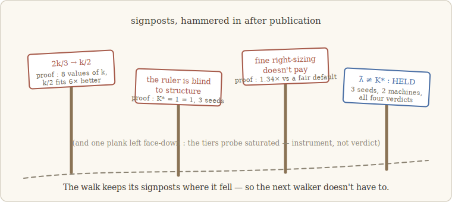

# Epilogue · Postcards from after the walk

> *A story ends; a walk doesn't.* — the lesson we walk with (our words)

Chapters 1–10 were finished, and published — and the walking continued that same week.
This page is where fresh verdicts land: dated, pre-registered like everything else,
and with one standing rule — **the ones that catch *us* go at the top, in full**. When
a postcard corrects a chapter, the chapter gets a signpost (chapter 7 wears the first
one), the claim documents are amended the same day, and this page keeps the story of
the "before" honest. Newest first.

---

**📮 July 2026 — "The freeze does not sort memorized from understood — we bet it would."**

Grokking is the cleanest natural experiment on the difference between *storing* answers
and *understanding* them: train a tiny network on modular addition and it memorizes the
training pairs almost instantly (train at 100 % by epoch 200), then — tens of thousands
of epochs later — abruptly *generalizes* (test at 100 % by epoch ~30,000; we reproduced
this textbook curve on two seeds). We pre-registered a bet: the freeze should tell the
two solutions apart — spare the memorized answers (they live in the weights) and kill
the generalizing ones (they live in a notebook). **Both kill criteria fired.** The
freeze collapses train *and* test, in *both* phases, identically (to ~0.01, both
seeds). No dissociation, anywhere.

And the autopsy is the lesson. At the readout position of a one-layer toy, the
embedding is the same for every example — so *all* example-specific information, stored
or understood, must flow through the very write we freeze. σ is the **only route**;
even a purely weight-stored solution has to express itself through it. The gesture
never had a chance to see the difference — and that is the bound, now measured three
ways: the freeze is blind to the *type of structure* (the matched grammars), to the
*computation upstream* (payload, not process), and now to the *storage regime*. **It
detects necessity — that something must pass here — uniformly, and nothing else.** One
crisp positive rode along: post-grokking, the generalizing notebook measures **K\* = 8**
(both seeds) — a new number that rhymes with the known Fourier-circuit account of
modular addition (Nanda et al., 2023).

---

**📮 July 2026 — "The coefficient, explained: the slope follows the spectral gap."**

The postcard below corrected our law to K\* ≈ k/2 and left the obvious question
hanging: *why one half?* The pre-registered follow-up asked whether the slope tracks
how fast the little world **forgets** — the hidden process's spectral gap |λ₂|. Turn
*that* dial (|λ₂| = 0.90, 0.95, 0.99) and the slope follows: **b = 0.425, 0.461,
0.583** (pre-registered bar: Δb > 0.10; measured: 0.158). An unpredicted bonus with the
same reading: the little +2 intercept **vanishes** as mixing slows (2.95 → 1.65 →
0.00) — slope rising, floor dissolving, both pointing at the geometric limit k−1 for a
world that never forgets. So "one half" was never fundamental: it is **b(|λ₂|)
evaluated at 0.95**, the mixing rate we had happened to use since the very first
hidden-state experiment. The law is spectral: **K\* ≈ b(|λ₂|)·k.** A coefficient we
corrected in public one week was derived from the world's own clock the next. Reserves,
in full: three gap values only (the clean jump sits at 0.99), one family of transition
structures (a *dependence* is established, not a functional form), and the second lever
— emission ambiguity — untouched.

---

**📮 July 2026 — "Ahh — no. The slope is one half."**

Chapter 7 published a law, K\* ≈ 2k/3, with its reserve stated: *the exact factor would
need more k.* We cashed the reserve — dial extended to k = 24, 30, 36, two seeds each.
Here is the proof, in one row:

| k | 24 | 30 | 36 |
|---|---|---|---|
| K\* measured | **12.5** | **15.5** | **18** |
| k/2 | 12 | 15 | 18 |
| 2k/3 | 16 | 20 | 24 |

Over eight values of k, the fit is K\* = 0.44·k + 2 (R² = 0.984), and **k/2 fits six
times better than 2k/3** (residuals 12.9 vs 77.1). Our pretty fraction was an artifact
of fitting through the origin on a short dial, where the small +2 intercept masquerades
as extra slope. What survives, strengthened: the law exists, better measured than ever
— and the discovered notebook compresses the belief *harder* than we had told you
(one half, even further below the geometric k−1). Falsifying k−1 took four rounds;
falsifying our own replacement took one honest extension. The dial always gets the
last word.

---

**📮 July 2026 — "The probe saturated; the mechanism keeps its secret."**

We went after chapter 6's open question — *why does one architecture compress its
notebooks to 4?* — with a depth × norm grid on deeper toys and a rich task. The probe
came back reading nearly the full dimension, everywhere, with no trend. That is not a
fact about norms; it is a fact about **our probe**: a σ that reads the *entire* written
residual — validated on the lean belief task, where the belief is nearly all the useful
computation — conflates every capability's notes on a rich task, and saturates.
Declared **inconclusive by instrument**, not read as a result (the plan had flagged the
risk in advance). The lesson was worth the price: **a notebook's address depends not
just on depth but on the task's richness** — probes do not transport between task
worlds. The tiers keep their secret; the scoped next step is to localize the induction
notebook in deep toys before re-running any grid.

---

**📮 July 2026 — "The ruler is blind to structure — we bet it wasn't."**

Pre-registered: the hierarchical grammar's notebook should be *bigger* than the local
one's. Measured, three seeds each: **exactly equal — K\* = 1 = 1.** The proof is the
verdict table itself: both grammars, all seeds, one direction, one bit. K\* measures
the payload carried, not the computation that fills it; which noun gets to *write* the
bit is routing, and routing is what the shadow witness catches (collapse to chance, both
grammars). Chapter 9 was amended the same day.

---

**📮 July 2026 — "Fine right-sizing doesn't pay — we hoped it would."**

We hired a fair adversary against our own engineering claim: an engineer who skips all
measuring and fixes one sensible default latent size, forever. With the measurement
honestly billed, *measure-then-size* costs **1.34× more** than the sensible default
over the whole task range; even an oracle handed the ideal size for free wins by only
1.23×; and our earlier "3–8× saved" was scored against an absurdly oversized default —
a strawman, retired. What survives: **the floor** (below K\*, failure at every budget
tried). Chapter 9 wears the seam.

---

**📮 July 2026 — "And one that held: three seeds, two machines."**

Lest this page suggest everything falls when shaken: the λ̂/K\* decoupling of chapter
8's coda, and both dimension laws, were re-run on fresh seeds — the new ones on two
different machines. **All four verdicts hold**, including the flatline that carries the
bound (inside the recurrent model, K\* triples while λ̂ barely moves, on every seed).
Shaking is the point; surviving it is the news.

---

The ledger stays open. If the next postcard is yours — a substrate we never touched, a
falsification we didn't see coming — chapter 10 tells you where the door is. It will be
posted here at full font size, with more pleasure than any confirmation.

— E.L.
